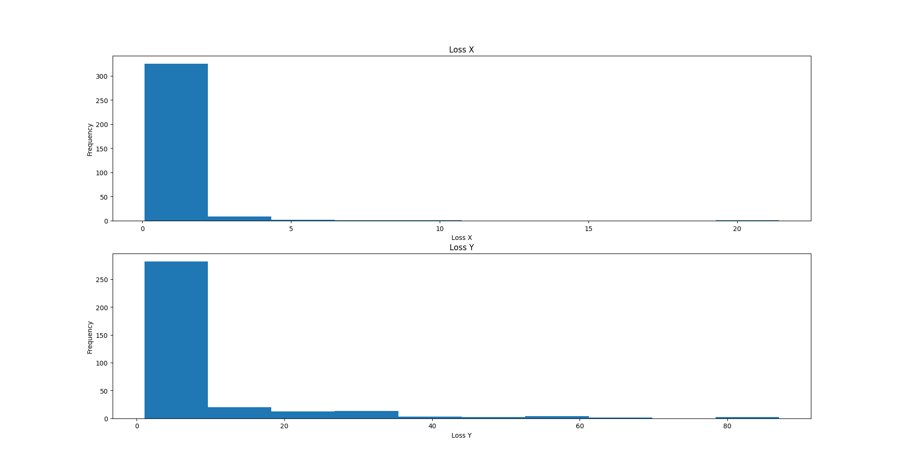

# rapport Algorithme génétique

## 1. Quelle est la taille de l'espace de recherche ?

Chaque paramètre appartient à l'intervalle [-100, 100].
On remarque que P3 et p6 sont le déphasage des signaux et appartiennent donc à [0, 2*pi].

ce qui prête à croire que:

    espace de recherche = p1*p2*p3*p4*p5*6 = ~6.3e10

**Or l'espace de recherche est continu donc il est infini.**

## 2. Quelle est votre fonction de fitness?

On sépare le problème en 2 morceaux: On cherche un groupe d'individus qui optimise l'erreur en X et un autre groupe qui optimise l'erreur en Y.
On cherche donc une fitness en X (*fitnessX*) et une autre fitness en Y (*fitnessY*).

La meilleure solution du problème est donc composée du meilleur individu de X et du meilleur individu de Y.

soit *k* un individu du groupe optimisant X avec gènes *kp1*,*kp2*,*kp3*.\
soit *l* un individu du groupe optimisant Y avec gènes *lp4*,*lp5*,*lp6*.

    fitnessX = 0
    fitnexxY = 0

    pour chaque point j du dataset avec jt, jx et jy ses coordonnées:

        fitnessX += (jx-kp1*sin(kp2*jt + kp3))**2
        fitnessY += (jy-kp4*sin(kp5*jt + kp6))**2
    

On fait la somme de l'erreur au carré.

## 3. Décrivez les opérateurs mis en œuvre (mutation, croissement)?

la sélection est faite suite à un tri des individus par leur fitness.
On sélectionne le top 30%.

les individus non sélectionés sont séparés en 2 groupes.
Le premier groupe est le groupe des enfants et le deuxième est le groupe des nouveaux.

les mutations sont appliquées à tous les individus sélectionnés et les enfants.

la mutation est l'addition d'une valeur aléatoire suivant une loi normale sur leurs genes. Les enfants mutent moins que les parents. 
la variance de la loi de mutation diminue avec le nombre de generation.

le croisement est just la reconstitution du meilleur individu par la combinaison du meilleur X et du meilleur Y.

## 4.  Décrivez votre processus de sélection.

La sélection est effectuée par un tirage sans remise de variable aléatoire où chaque individu à une probabilité de passer à l'étape suivante:

    p = 1/(fitness de l'individu)/(somme des fitness)

## 5. Quel est la taille de votre population, combien de générations sont nécessaires avant de converger vers une solution stable?

voici un graph de l'évolution du fitness en fonction des générations 
pour une population de 25000 individus sur X et 25000 sur Y:

    temps moyen par génération:= 0.034065393623316963 s

En bleu clair l'écart entre la pire et la meilleure fitness.
en bleu foncé la fitness moyenne.
la fitness moyenne reste presque constante car les individu aléatoires ont tendance à être très mauvais.

On remarque que la stabilisation de la meilleure loss est du à la stabilisation du taux de mutation.

On remarque que la loss la plus faible est la meilleur et que elle converge après **200** generations. ce qui équivaut à ~6s.

voici un autre graph interessant:

bleu foncé est meilleur.
On observe comment les meilleurs deviennent vraiment meilleur et comment les individus aléatoires et trops de mutations sont très mauvais.

## 6. Combien de temps votre programme prend en moyenne (sur plusieurs runs)?

avec les parametres suivants:

    nombre de execution:   339
    taille de population:  25000
    Nombre de generation:  201

le temps moyen d'éxecution complet est *6.8435907082571745* (s)\
le temps d'éxecution moyen par génération est: *0.034047714966453604* (s)\
voici les graphs de ces exepriences:

## 7. Si vous avez testé différentes solutions qui ont moins bien fonctionnées, décrivez-les et discutez-les.

Je me suis principaklement intressé à la loi de selection.
Je me suis appercue que une loi plus "élitiste" est préférable.
Il faut cependant garder un renouvellement genetique de la population élevé pour assurer une certaine répetabilité.
